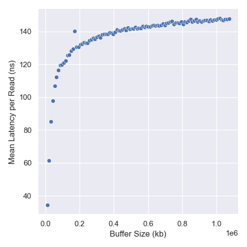

# Reed CS389: Memory Benchmarking

## Code Tour

The code here is pretty simple. `bench.c` implements a simple benchmarking loop
given a number of iterations. `main.c` drives this loop, printing the data as a
csv. Plots are built by `plot.py`, which depends on `poetry` for python
virtualization to run via the `bench.png` make target.

## Strategy

To stop the compiler from optimizing out the fetch, it suffices to label the
variable volatile; I confirmed this by reading the assembly with `-O3` turned
on.

The strategy is to an array of a small number of random indices, start the
timer, fetch from each of those indices, then stop the timer. This strategy is
designed to avoid the issue of a single fetch being too small to time, with the
hope that the overhead from fetching from the small array of random indices
would have negligible overhead due to the small size of the array, and since it
was stack-allocated.

It also seems to avoid prefetching; this makes sense, as the elements are
accessed randomly and in small bursts. Reading the assembly, even with `-O3` the
compiler doesn't do anything to unroll this offsets array by hand, or similar.
All the calls to memory are between the two gettime calls in the assembly.

I ended up unrolling this loop manually to further reduce the overhead. Here is
the central code:

```c
offsets[0] = rand() % buffer_size;
offsets[1] = rand() % buffer_size;
offsets[2] = rand() % buffer_size;
offsets[3] = rand() % buffer_size;
offsets[4] = rand() % buffer_size;
offsets[5] = rand() % buffer_size;
offsets[6] = rand() % buffer_size;
offsets[7] = rand() % buffer_size;
offsets[8] = rand() % buffer_size;
offsets[9] = rand() % buffer_size;

clock_gettime(CLOCK_MONOTONIC, &start);
_ = buffer[offsets[0]];
_ = buffer[offsets[1]];
_ = buffer[offsets[2]];
_ = buffer[offsets[3]];
_ = buffer[offsets[4]];
_ = buffer[offsets[5]];
_ = buffer[offsets[6]];
_ = buffer[offsets[7]];
_ = buffer[offsets[8]];
_ = buffer[offsets[9]];
clock_gettime(CLOCK_MONOTONIC, &stop);
```

## Data

For each run, I take 10^7 iterations of 10 fetches each for each buffer size.

Here is a run of powers of 2 buffer sizes up to 2^15 on patty (both axes have
log scales):


You can see one step between 10^2 and 10^3 and another between 10^4 and 10^5;
since it seems like this is where the interesting behavior is occuring, we can
run linear searches in those ranges to more closely analyze these ranges.

### ~10^2-10^3

Here is a run of 20 buffer sizes in even intervals up to 2^6 on patty:

Here is a runs of 20 buffer sizes in even intervals up to 2^10 on patty:


We see a clear step at buffer sizes close to 500kb; patty's L2 cache is 512kb.

### ~10^4-10^5

Here is a run of 20 buffer sizes in even intervals up to 2^15 on patty:


Again, there's a clear step around 16e3kb; patty's L3 cache is indeed 16mb.

### Small Buffers

Finally, because the first few data points in our initial graph were hard to
decipher, here is a run of 20 buffer sizes in even intervals up to 100kb on patty:


This behavior is harder to analyze. I think it's likely that the overhead is
hurting us here.

## Analysis

It's pretty clear that we have successfully identified patty's L2 and L3 cache
sizes as lying around 500kb and 16mb. The spikes occur because the caches are no
longer able to store the entire array, and so we are forced to start fetching
semi-regularly from the next cache level.

The L1 cache (patty's is 32kb) was more evasive, likely due to the overhead of
our offsets array being more relevant for such small fetch times.

## Addendum: Questioning a Failed Strategy

In the simplest strategy, you fill an array with `N` random items, choose a
random offset from `0` to `N-1`, start the clock, fetch from that offset, and
stop the clock. It seems like it would be difficult for the prefetcher to
overcome this strategy, since the random offset is not known until immediately
before the fetch.

Nonetheless, here is data collected on my local machine, running 10^7 fetches on
100 buffer sizes in even intervals up to 2^30:



To be honest, I find this data hard to explain. It's clear that there is
prefetching going on, but the offset I'm fetching from is not known until
immediately before the fetch occurs, and from looking at the disassembly it
seems that the compiler isn't doing anything that would circumvent this. In
particular, it looks like the call to `rand` puts the result in the `eax`
register on my architecture, which is not touched until after the start time has
been fetched, so it can't be doing anything that tells the hardware to start
fetching. The actual fetch happens in an `movb` instruction that definitively
occurs between the two `clock_gettime` calls.
